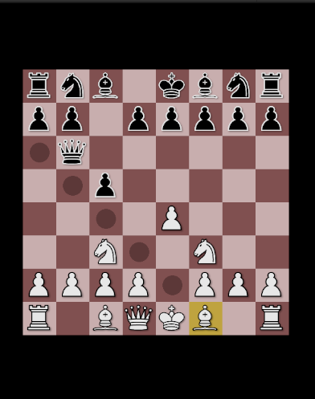
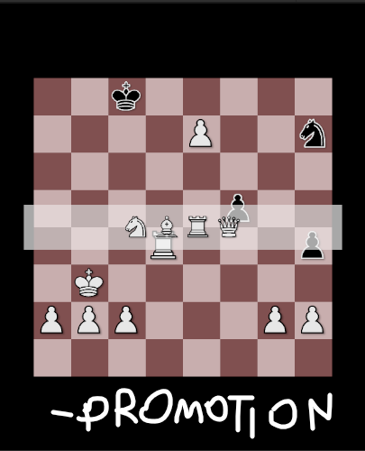

# ChessEngine (Unity)

A basic chess engine made with Unity. Uses minimax (3 plys) with alpha–beta pruning, move reordering, and a compact 1D board representation. Playable online via WebGL.

### Play the Game
[https://4dith.github.io/ChessEngine/](https://4dith.github.io/ChessEngine/)

## Features
- Fully interactive Chess board
- Promotions UI
- Checkmate detection
- Basic AI opponent

## Screenshots



## Tech Stack
* Unity 6.2 (C#)
* WebGL Build
* GitHub Pages for hosting

## Folder Structure
```
Assets/Scripts/ - Game Code
Asets/128px/ - Chess Pieces (PNG)
docs/ - WebGL Build
```

## Credits 
### Chess Piece Sprites 
This project uses sprites from **JohnPablok's improved Cburnett chess set**, licensed under **CC BY-SA 3.0**. 
Original asset: https://opengameart.org/content/chess-pieces-and-board-squares 
No modifications were made. 
License: https://creativecommons.org/licenses/by-sa/3.0/

## Future Improvements
- Opening books and Endgame Databases 
- Quiescence Search - Extend search depth until stable board position is reached
- UI Improvements - Main Menu and Settings Screen

## Licensing
- **Art assets (sprites)** — CC BY-SA 3.0 (see Credits above). Any derivative works of the sprites must remain under CC BY-SA.
- **Code** — MIT License
[https://opensource.org/license/mit](https://opensource.org/license/mit)